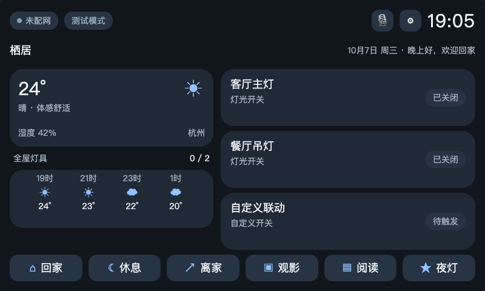
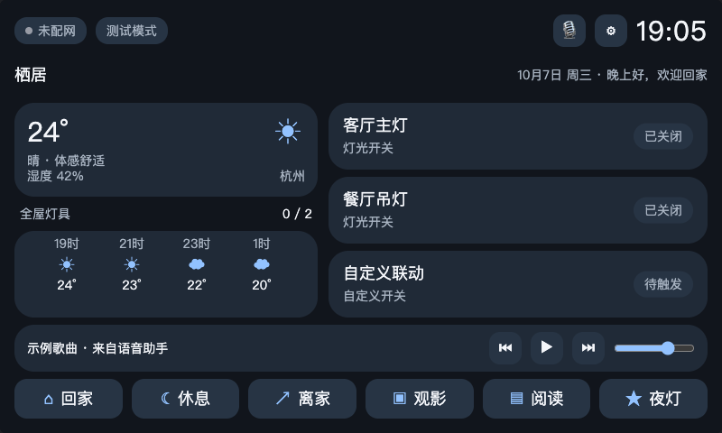

# Mi Home 风格 Matter 三路面板（ESP32-S3）

## ESP-IDF 开发环境

本工程使用 ESP-IDF 5.5.5，目标芯片为 `esp32s3`。当前 macOS 用户环境检测到 IDF 5.5.5 已安装于 `~/.espressif/v5.5.5/esp-idf`，并具备配套工具目录；工具链保留在用户级 IDF 安装位置，不复制进仓库。

在仓库根目录初始化终端并构建：

```bash
source os/export_idf.sh
idf.py --version
idf.py set-target esp32s3
idf.py build
```

脚本加载 IDF 环境、设置 `IDF_TARGET=esp32s3` 并切换到 `os/`。若 IDF 安装在其他路径，先设置 `IDF_PATH=/path/to/esp-idf`。VS Code 默认构建任务为 **ESP-IDF: Build**，并提供设置目标和 `menuconfig` 任务。首次构建可能需要联网下载 `espressif/esp_matter` 及依赖。

这是一个 ESP-IDF + ESP-Matter 固件工程骨架：Matter over Wi-Fi 节点当前包含 2 个标准 On/Off Light endpoint 和 1 个 Generic Switch endpoint；3 个低压实体按钮映射到这 3 个 endpoint；可选 GPIO 用于驱动外部隔离继电器模块。代码不会直接驱动灯具市电。

面板视觉稿在 [`ui/panel-preview.html`](ui/panel-preview.html)；与当前固件触摸界面同步的交互预览在 [`ui/firmware-preview.html`](ui/firmware-preview.html)，均按 800×480（5:3）比例，可用桌面浏览器打开。固件预览包含通道绑定、空调控制、语音助手和音乐播放控制栏；点击页面说明中的“音乐控制预览”可直接查看音乐栏。预览数据仅用于交互演示，不连接真实设备或天气 API。视觉与交互说明及截图见 [`UI_DESIGN.md`](UI_DESIGN.md)。Matter 提供温湿度等设备测量集群，但不负责城市天气或天气预报；真实天气需由设备单独连接天气数据源。



音乐控制栏在播放期间显示：



设置模式 UI 位于 [`ui/settings.html`](ui/settings.html)，服务接口契约见 [`SERVICE_API.md`](SERVICE_API.md)。固件侧 `panel_services` 已提供天气、全屋灯具、场景 provider API 和 NVS 测试模式接口；HTTP server/routes 和真实 provider 仍待接入。测试模式默认开启，跳过继电器输出，适合安全验证。

### 4.3 英寸 DSI 屏适配限制

如果你指的是 Waveshare `4.3inch DSI LCD`，该型号是 800×480 MIPI DSI 触屏。ESP32-S3 的官方 LCD 控制器支持 RGB 等接口，但没有该屏所需的 MIPI DSI PHY/host，不能直接用 S3 的 DSI 排线驱动。此工程暂不声明可直接点亮该屏。实现此硬件组合需要外部 RGB-to-DSI bridge（须确认其兼容该面板及初始化序列），或换用原生支持 DSI 的主控/显示板，或改用 ESP32-S3 可驱动的 RGB/8080/SPI 屏。面板 UI 已重排为 800×480；固件不启用假定的 LCD 初始化代码。

## 硬件和安全边界

推荐硬件清单、供电方案（成品市电经隔离 AC-DC 转 5V；前期测试使用 5V USB）和连接关系见 [`HARDWARE.md`](HARDWARE.md)。

项目根目录的 `esp32-s3_datasheet_cn.pdf` 是 ESP32-S3 系列芯片技术规格书 v2.2，确认该 SoC 有 45 个可编程 GPIO、双核 LX7（最高 240 MHz）、2.4 GHz Wi-Fi 与 Bluetooth LE；它不是开发板原理图，也未说明你手中模组/开发板哪些脚实际引出。根目录 `io接口.png` 是经典 ESP32-WROOM DevKitC 引脚图，不能用于 S3 接线。`CONFIG_PANEL_SWITCH_n_GPIO` 和 `CONFIG_PANEL_RELAY_n_GPIO` 位于 `menuconfig → Home panel hardware`；默认 GPIO 4/5/6 是一般 GPIO 的候选示例，实际连接前仍需对照具体 ESP32-S3 DevKitC 版本和模组原理图核对是否引出/占用。

规格书列出启动绑带 GPIO0、GPIO45、GPIO46；USB 默认功能使用 GPIO19/20；封装内 Flash/PSRAM 方案也会占用相应存储器管脚。不要将这些脚作为默认开关配置，且须确认具体芯片/模组存储配置。芯片数据手册只能确认芯片级能力和复用，不能代替开发板引脚图。

按钮只接 GPIO 与 GND，推荐外接开关两端接入具有合适限流/隔离的低压输入电路。继电器 GPIO 只能连接有反灌保护的隔离继电器驱动板输入端；ESP32 GPIO 不得连接交流市电或灯具导线。市电侧安装需由具备资质人员完成，使用符合当地法规的隔离、保险和外壳。启动时继电器输出为关闭。

## 构建

从仓库根目录加载项目环境后构建：

```sh
source os/export_idf.sh
idf.py set-target esp32s3
idf.py menuconfig
idf.py build
idf.py flash monitor
```

ESP-IDF 5.5.5 与 ESP-Matter 1.6.0 已通过本机首次构建。首次配网使用 Matter commissioning 二维码或 setup code，生产使用前必须配置正式 DAC/PAI 和制造商数据，不能用测试 attestation 发布产品。

## 当前实现与下一步

固件底层架构与核心算法已实现并编译通过（`idf.py build` 生成 `matter_home_panel.bin`，app 分区剩余约 47%）。分层设计、任务划分和每个算法的说明见 [`ARCHITECTURE.md`](ARCHITECTURE.md)。

- **Matter 数据模型**：endpoint 1/2 为 On/Off Light，endpoint 3 为 Generic Switch（momentary + action switch feature，上报 InitialPress/ShortRelease/SwitchLatched 事件）。本地开关、场景和 Matter 客户端写入三方汇聚到同一条通道路由，继电器与状态模型保持单一权威。
- **实体开关输入**：积分式消抖状态机（默认 25 ms，5 ms 采样），menuconfig 可选瞬动按钮（按下切换）或保持型翘板（电平同步），支持 550 ms 长按识别。
- **状态与持久化**：`app_state` 为唯一状态源（互斥锁 + 快照 + 监听通知任务）；面板名称、主题、固定场景等用户配置以带版本号的 blob 存 NVS，断电保留；天气最后有效值也落 NVS。
- **时间**：STA 获得 IP 后启动 SNTP（默认 `ntp.aliyun.com`，POSIX 时区可配），问候语四段与昼夜判定只在分钟/状态变化时提交，避免无效刷新。
- **天气**：Open-Meteo 兼容适配器（HTTPS + 证书 bundle），WMO 天气码映射为晴/多云/雨/雪四桶，逐小时预报按 [now, +2, +4, +6 h] 采样；离线时保留最后一次快照并标记 stale，未拉取成功前显示演示数据。
- **场景引擎**：内置 5 个场景（与 HTML 原型状态矩阵一致），执行只作用于本机 2 路灯具；固定场景最多 3 个并持久化。
- **服务接口**：`panel_services` 保持既有 provider vtable 与 NVS 测试模式；`service_providers` 把具体服务注册为其 provider。测试模式下继电器输出始终被抑制（安全预览），天气因只读不受影响。
- **待办**：HTTP server 路由、全屋灯具的家庭控制器同步、LVGL/LCD 驱动（见 SERVICE_API.md 的 DSI 屏限制）、每路自定义动作的落地执行。

## 参考

ESP-IDF 是 ESP32-S3 官方框架；Matter endpoint 和属性回调按 ESP-Matter 官方开发指南组织。参考：[ESP-IDF ESP32-S3](https://documentation.espressif.com/esp-idf/en/stable/esp32s3/index.html)、[ESP-Matter developing](https://docs.espressif.com/projects/esp-matter/en/latest/esp32s3/developing.html)。
